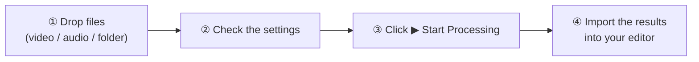

<div align="center">

<h1>✂ SnipSync</h1>
<p><strong>Silent Auto-Cutter & Subtitle Generator for Professional Video Editors</strong></p>

[](https://www.python.org/)
[](https://github.com/TomSchimansky/CustomTkinter)
[](https://github.com/SYSTRAN/faster-whisper)
[](https://github.com/WyattBlue/auto-editor)
[](LICENSE)
[](https://www.microsoft.com/windows)
[](https://github.com/R3NeR3N/SnipSync/releases/latest)

[English](README.md) | [日本語](README_JA.md) | [简体中文](README_ZH.md) | [한국어](README_KO.md)

</div>

---

## About SnipSync

**SnipSync** is a standalone desktop application for Windows that automates the most tedious parts of video editing. Drop in your footage, and SnipSync will:

1. **Detect and remove silent segments** using a configurable audio threshold — powered by `auto-editor`.
2. **Export a ready-to-import timeline** in the format of your choice (.fcpxml or .xml) — no rendering required.
3. **Generate a perfectly-synced subtitle file** (.srt) using the built-in AI transcription engine `faster-whisper`.

Because the subtitle pipeline runs transcription on the *already-cut* audio (not the raw source), timecodes in the `.srt` file are always in perfect sync with the exported timeline — a problem that plagues most other tools.

No Python installation required. SnipSync ships as a single `.exe` file.

---

## ✨ Features

| Feature | Details |
|---|---|
| 🔇 **Auto Silent Cut** | Automatically detects and removes silent portions from any video |
| 🎬 **NLE Timeline Export** | Exports cut-ready timelines for DaVinci Resolve, Final Cut Pro, and Premiere Pro |
| 📝 **AI Subtitle Generation** | Generates `.srt` files with `faster-whisper` — no timecode drift |
| ⚙️ **Fine-grained Controls** | Adjustable volume threshold (%) and silence margin (seconds) |
| 🤖 **Model Size Selection** | Choose from `tiny` / `base` / `small` / `medium` Whisper models |
| 🌐 **Multilingual UI** | Full Japanese / English interface switchable at runtime |
| 📁 **Drag & Drop** | Simply drag your video file onto the app window |
| 📦 **Zero Setup** | Ships as a single `.exe` — no Python, no dependencies to install |
| 🎙 **Voice-Activity Cut** | Choose volume threshold or speech detection (Silero VAD); optionally speed silence up instead of cutting |
| 〰 **Waveform Preview** | See exactly what will be cut before you process |
| 🧩 **Batch & Audio Files** | Drop several files or a folder; audio-only inputs and cut-media export supported |
| 🈶 **Readable Subtitles** | Japanese phrase-aware line breaks (BudouX), glossary hints, optional speaker separation |
| 📄 **Transcript Export** | Preview and save the whole transcript as `.txt` / `.md` / `.srt` |
| 📍 **Timeline Markers** | Optional cut-point / speaker-change markers (not yet verified in a real NLE) |
| 🤖 **More Models** | large-v3-turbo, large-v3, kotoba-whisper (experimental), distil-large-v3 (English only) |

### Supported Export Formats

| Format | Target Application | File Extension |
|---|---|---|
| `resolve` | DaVinci Resolve | `.fcpxml` |
| `final-cut-pro` | Final Cut Pro | `.fcpxml` |
| `premiere` | Adobe Premiere Pro | `.xml` |

### Supported Input Formats

`.mp4` · `.mov` · `.avi` · `.mkv` · `.wmv` · `.flv` · `.webm` · `.m4v` · audio: `.wav` · `.mp3` · `.m4a` · `.flac` · `.aac` · `.ogg` · `.opus` · `.wma`

---

## 🚀 Installation

### Option A: Run the Pre-built EXE (Recommended)

> No Python, FFmpeg, or any other software needed.

1. Download `SnipSync.exe` from the [Releases](https://github.com/R3NeR3N/SnipSync/releases/latest) page.
2. Place it anywhere on your PC (e.g., your Desktop).
3. Double-click `SnipSync.exe` to launch.

**First-run downloads** (internet required, once only):

| What | When | Size |
|---|---|---|
| Whisper model | The first time you generate subtitles with that model | `tiny` 0.08 GB · `base` 0.15 GB · `small` 0.49 GB · `medium` 1.5 GB · `large-v3-turbo` 1.6 GB · `large-v3` 3.1 GB · `distil-large-v3` 1.5 GB · `kotoba-whisper` 1.5 GB |
| Speaker-separation models | The first time you turn on **Separate speakers** | about 35 MB |

> **💡 Where things are stored (and how to remove them)**
> - Whisper models: `C:\Users\<YourUsername>\.cache\huggingface\hub`
> - kotoba-whisper, speaker-separation models, presets: `%APPDATA%\SnipSync`
>
> Deleting `SnipSync.exe` does not remove them. To free disk space, delete those folders manually.

---

### Option B: Run from Source

#### Prerequisites

- Windows 10 / 11 (64-bit)
- [Python](https://www.python.org/downloads/) 3.10 or later (tick **Add python.exe to PATH** in the installer)
- [Git](https://git-scm.com/downloads) (or download the repository as a ZIP from GitHub and unzip it)
- FFmpeg is **not** required.

#### Steps (PowerShell or Command Prompt)

```bash
git clone https://github.com/R3NeR3N/SnipSync.git
cd SnipSync
python -m venv .venv
.venv\Scripts\python.exe -m pip install -e .
.venv\Scripts\python.exe src\app.py
```

`python -m venv .venv` creates an isolated environment inside the `SnipSync` folder, so nothing is installed system-wide. To remove it, just delete the `.venv` folder.

The first time you process a file, SnipSync downloads auto-editor 31.7.2 (about 45 MB) from its official GitHub release and verifies its SHA-256 before using it.

---

### Option C: Build the EXE yourself (PyInstaller)

Run these in the same `SnipSync` folder (after the steps above):

```bash
.venv\Scripts\python.exe -m pip install -e ".[build]"
.venv\Scripts\python.exe scripts\fetch_auto_editor.py
.venv\Scripts\python.exe -m PyInstaller build\app.spec
```

`fetch_auto_editor.py` downloads auto-editor (SHA-256 verified) so that it can be bundled into the EXE. The result is written to `dist\SnipSync.exe`.

---

## ⚙️ How to Use

### Quick start



> The screenshots use a short sample recording of two synthesized voices. SnipSync's screen is available in Japanese and English (switch with the **Language** menu at the top right); the screenshots show the English screen.

#### 1. The main window

<p align="center"></p>

| # | Where | What it is |
|:-:|---|---|
| ① | Drop zone | Drop one or more video/audio files (or a whole folder) here, or click to browse |
| ② | Cut settings | **Silence Margin**, **Volume Threshold**, **Cut Method** (volume or voice detection) and **Silence** (cut it out, or speed it up) |
| ③ | Export Format | DaVinci Resolve / Premiere Pro / Final Cut Pro, or *Cut media* (a rendered video/audio file) |
| ④ | Subtitles | Turn subtitles on and pick the AI model. `large-v3-turbo` is recommended |
| ⑤ | Subtitle details and extras | Split at cut boundaries, line length, **speaker separation**, `.txt` / `.md` export, timeline markers, glossary, output folder |
| ⑥ | **▶ Start Processing** | Runs everything. **■ Stop** cancels |
| ⑦ | Waveform Preview | See what will be cut *before* you process |
| ⑧ | Subtitle Preview | Read, copy and save the whole transcript |

#### 2. Press Start and watch the log

<p align="center"></p>

The **Log** at the bottom shows each step: cutting, speech recognition (with the recognised text), speaker separation, and the files written. When it finishes, SnipSync offers to open the output folder.

Outputs are written next to each input file (or to the folder you choose):

| File | What it is |
|---|---|
| `<name>_snipsynced.fcpxml` / `.xml` | The cut timeline (plus a `<name>_tracks` folder for multi-track audio — keep it next to the `.fcpxml`) |
| `<name>_snipsynced.mp4` / `.wav` … | Cut media, when the export format is *Cut media* |
| `<name>.srt` | Subtitles |
| `<name>.txt` / `<name>.md` | Whole transcript, if you ticked them |

#### 3. (Optional) Check what will be cut — Waveform Preview

<p align="center"></p>

| # | What it shows |
|:-:|---|
| ① | Length before → after, the saving, and the number of cuts |
| ② | **Red** = removed, **orange** = sped up. Everything else is kept |
| ③ | **Recalculate** after you change the margin, threshold or cut method |

#### 4. (Optional) Read the whole transcript — Subtitle Preview

<p align="center"></p>

| # | What it does |
|:-:|---|
| ① | Switch between `.txt`, `.md` and `.srt` views |
| ② | Include or hide the timestamps |
| ③ | **Copy** the text to the clipboard |
| ④ | **Save…** it as a file |
| ⑤ | **Open SRT…** — load any existing `.srt` to read it or convert it to `.txt` / `.md` |

#### 5. Import the results into your editor

See [Importing into your editor](#importing-into-your-editor) below.

### Settings

| Setting | What it does |
|---|---|
| **Silence Margin** | Extra time kept around speech at each cut (default `0.20 s`) |
| **Volume Threshold** | Level below which sound counts as silence (default `4.0 %`). Not used by *Voice detection* |
| **Cut Method** | *Volume threshold*, or *Voice detection (VAD)* — cuts everything that is not a human voice, so it usually copes better with background noise |
| **Silence** | *Cut out* removes silence; *Speed up* keeps it but plays it at the speed you set (default ×8) |
| **Export Format** | DaVinci Resolve, Premiere Pro, Final Cut Pro, or *Cut media* (a rendered video/audio file) |
| **Subtitles** | Generate `.srt` with Whisper |
| **AI Model Size** | `tiny`/`base`/`small` are fast; **`large-v3-turbo` is the recommended accurate model**; `kotoba-whisper` is Japanese-specialised but experimental (its word timing is coarse); `distil-large-v3` is English only |
| **Use GPU (CUDA)** | Optional. Needs an NVIDIA GPU with CUDA 12 and cuDNN 9 |
| **Split subtitles at cut boundaries** | Starts a new subtitle at every cut, so subtitles line up with your clips |
| **Chars per subtitle line** | Wraps Japanese at natural phrase boundaries (BudouX) and keeps each subtitle to 2 lines. `0` turns it off (default `20`) |
| **Separate speakers** | Labels who is speaking (`Speaker 1: …`) and starts a new subtitle when the speaker changes. Set **Speakers** if you know how many people there are |
| **Also write .txt / .md** | Saves the whole transcript (with speakers and timestamps) next to the subtitles |
| **Add markers** | Adds markers for every cut and every speaker change to the timeline *(experimental — see notes)* |
| **Glossary** | Comma-separated terms (names, product names) that Whisper should prefer |
| **Preset** | Save and load a whole set of settings. Your last settings are restored on launch |

### Recipes

- **Talking-head video → DaVinci Resolve with subtitles**: Export Format *DaVinci Resolve*, Subtitles on, model `large-v3-turbo`. Import the `.fcpxml`, then the `.srt`.
- **Interview or podcast with several people**: tick **Separate speakers** (set **Speakers** if you know the count) and **Also write .md**. You get speaker-labelled subtitles and a readable transcript.
- **Noisy room or background music**: set **Cut Method** to *Voice detection (VAD)*.
- **Keep the pauses but make them fast**: set **Silence** to *Speed up*.
- **A pile of recordings**: drop the whole folder. The AI model is loaded once and reused.
- **Just need a clean audio file**: drop a `.wav` / `.m4a` / `.mp3`, choose *Cut media*. You get a `.wav` (see notes).

### Importing into your editor

Menu names can differ slightly between versions.

| Editor | Timeline | Subtitles |
|---|---|---|
| DaVinci Resolve | File → Import → Timeline… → choose the `.fcpxml` | File → Import → Subtitle…, or drag the `.srt` onto the timeline |
| Premiere Pro | File → Import → choose the `.xml` | Import the `.srt` and drag it onto the sequence |
| Final Cut Pro | File → Import → XML… → choose the `.fcpxml` | File → Import → Captions… |

### Notes

- **Cut media export at 4K**: the bundled auto-editor (no license key) scales rendered output down to 3200×1800 or less. SnipSync warns you before it starts. **Timeline exports are not affected** — use them for full-resolution work.
- **Audio-only cut media** is written as `.wav` / `.flac` / `.ogg` / `.opus`. `.mp3`, `.m4a`, `.aac` and `.wma` are written as `.wav` because the bundled auto-editor has no encoder for them.
- **Markers** are experimental: they have not yet been verified by importing into every editor.
- **Cuts differ from SnipSync 0.1.0**: the newer auto-editor also removes cuts and clips that are too short (`--smooth`), so you will see fewer, longer cuts.
- Subtitles start at the first spoken word, so each subtitle begins a little after the start of its clip. This is expected (the margin is kept silent).

---

## 🖥️ Requirements

### Runtime (EXE users)
- **OS:** Windows 10 / 11 (64-bit)
- **RAM:** 4 GB minimum; 8 GB+ recommended for `medium` and larger models
- **Disk:** about 0.1–3 GB for the Whisper model you choose (first run only)
- **Internet:** Only for first-run downloads (Whisper models, speaker-separation models)
- **GPU:** (Optional) NVIDIA GPU with CUDA 12 and cuDNN 9 on your system PATH. GPU libraries are NOT bundled in the EXE.

### Development (source users)

| Package | Purpose |
|---|---|
| auto-editor 31.x *(official binary, fetched and verified by `src/aebin.py`)* | Silence/voice cut engine & NLE export |
| `faster-whisper` | AI speech-to-text (CTranslate2) and Silero VAD |
| `sherpa-onnx` | Speaker separation |
| `budoux` | Japanese phrase-aware line breaks |
| `defusedxml` | Safe XML parsing |
| `av` · `numpy` | Audio decoding and processing |
| `customtkinter` · `tkinterdnd2` | GUI and drag-and-drop |
| `pyinstaller` | *(Build only)* Packages the app into a single `.exe` |

---

## 📜 License

This project is licensed under the **MIT License**.

> **Disclaimer:** SnipSync is provided "as-is" without any warranty. The author is not responsible for any data loss, file corruption, or other issues arising from the use of this software. Always keep backups of your original source footage.

> SnipSync uses [auto-editor](https://github.com/WyattBlue/auto-editor) (Unlicense; the official binary limits *rendered* output to 3200×1800 without a license key, timeline exports are unaffected), [faster-whisper](https://github.com/SYSTRAN/faster-whisper) (MIT), [BudouX](https://github.com/google/budoux) (Apache-2.0) and [sherpa-onnx](https://github.com/k2-fsa/sherpa-onnx) (Apache-2.0). Models: Whisper (MIT), kotoba-whisper (MIT), pyannote segmentation-3.0 ONNX (MIT), 3D-Speaker CAM++ (Apache-2.0). Please refer to each project for their respective licenses.

---

<div align="center">

Made with ❤️ for video creators who hate silence.

</div>
