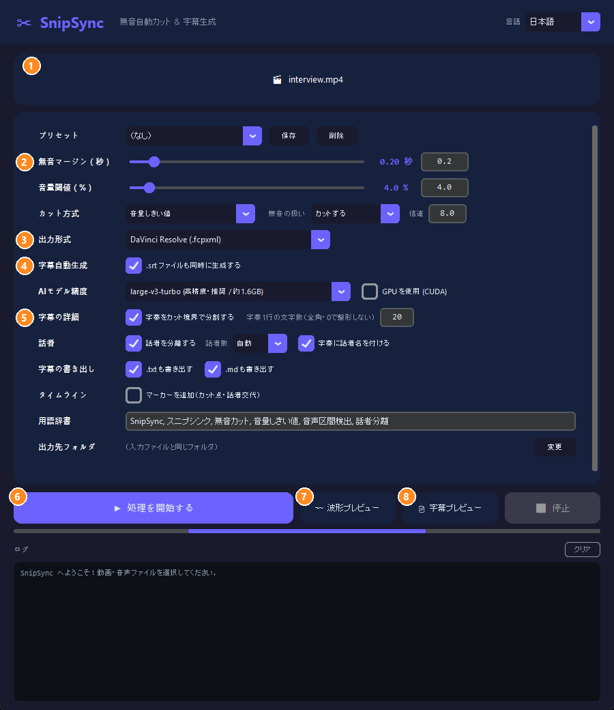
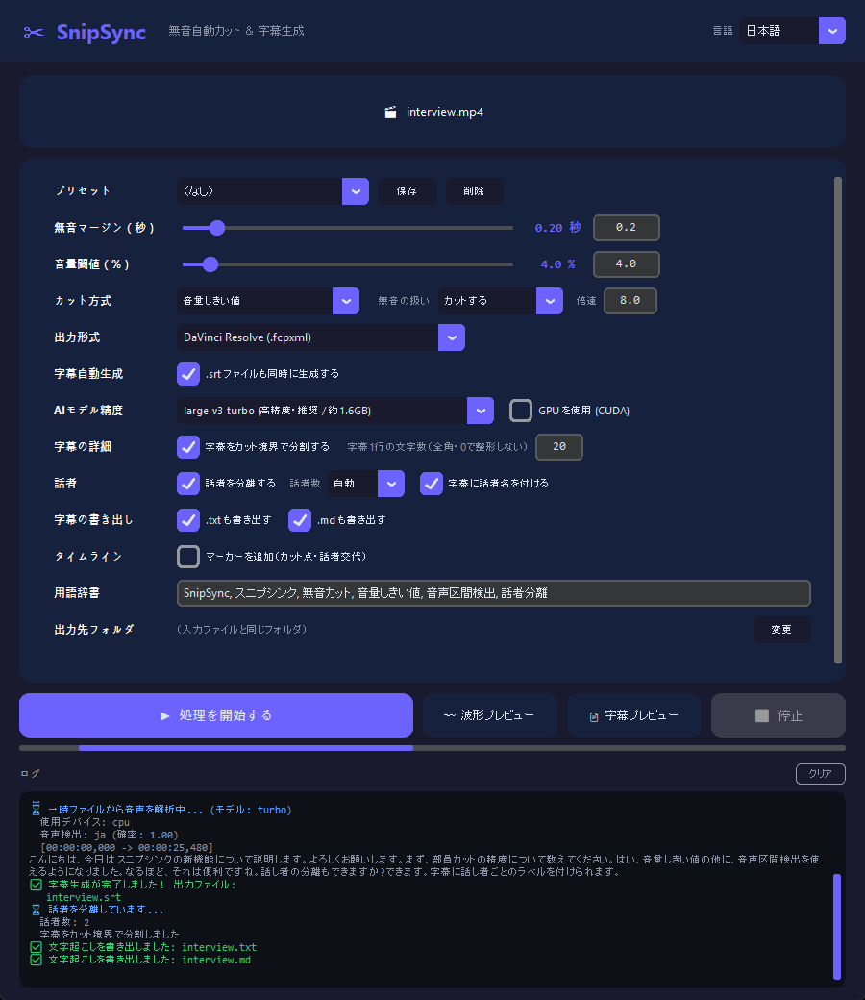
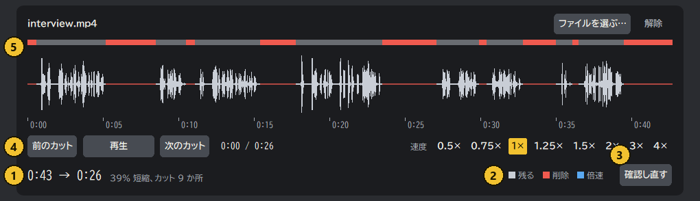
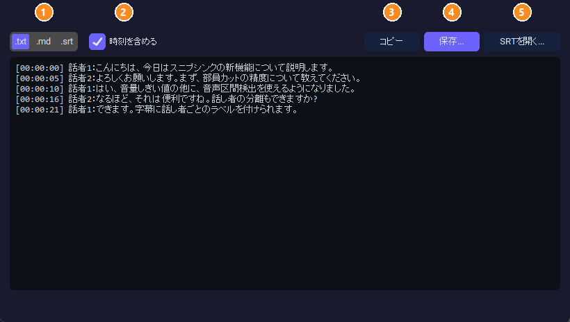

<div align="center">

<h1>✂ SnipSync</h1>
<p><strong>プロの動画クリエイター向け 無音自動カット＆字幕生成ツール</strong></p>

[](https://www.python.org/)
[](https://github.com/TomSchimansky/CustomTkinter)
[](https://github.com/SYSTRAN/faster-whisper)
[](https://github.com/WyattBlue/auto-editor)
[](LICENSE)
[](https://www.microsoft.com/windows)
[](https://github.com/R3NeR3N/SnipSync/releases/latest)

[English](README.md) | [日本語](README_JA.md) | [简体中文](README_ZH.md) | [한국어](README_KO.md)

</div>

---

**目次**

- [SnipSyncについて](#snipsyncについて)
- [✨ 主な特徴](#-主な特徴)
  - [対応エクスポート形式](#対応エクスポート形式)
  - [対応入力形式](#対応入力形式)
- [🚀 インストール](#-インストール)
  - [方法A: ビルド済みEXEを使う（推奨）](#方法a-ビルド済みexeを使う推奨)
  - [方法B: ソースから実行する](#方法b-ソースから実行する)
  - [方法C: EXEを自分でビルドする（PyInstaller）](#方法c-exeを自分でビルドするpyinstaller)
- [⚙️ 使用方法](#%EF%B8%8F-使用方法)
  - [まずはこれだけ](#まずはこれだけ)
  - [設定項目](#設定項目)
  - [用途別の手順](#用途別の手順)
  - [編集ソフトへの取り込み](#編集ソフトへの取り込み)
  - [注意](#注意)
- [🖥️ 動作環境・依存ライブラリ](#%EF%B8%8F-動作環境依存ライブラリ)
  - [実行環境（EXEユーザー向け）](#実行環境exeユーザー向け)
  - [開発環境（ソースユーザー向け）](#開発環境ソースユーザー向け)
- [📜 ライセンス](#-ライセンス)

---

## SnipSyncについて

**SnipSync** は、動画編集の最も面倒な作業を自動化するWindows向けのスタンドアロン・デスクトップアプリケーションです。動画ファイルをドロップするだけで、SnipSyncが以下の処理を全自動で行います。

1. **無音部分を自動検知・除去** — `auto-editor` を使用し、設定可能な音量閾値で無音区間を検出します。
2. **そのままインポートできるタイムラインデータを出力** — レンダリング不要で、選択した形式（.fcpxml / .xml）を書き出します。
3. **完全同期された字幕ファイル（.srt）を自動生成** — 内蔵AIエンジン `faster-whisper` が高精度な字幕を出力します。

字幕パイプラインは「カット済みの音声」に対してWhisperを実行するため、`.srt` のタイムコードがタイムラインと完全に同期します。他ツールでよく問題になるタイムコードのズレが原理的に発生しません。

Pythonのインストール不要。SnipSyncは単一の `.exe` ファイルとして動作します。

**会議の議事録づくりにも使えます。** Zoom や Teams、対面で録った会議の音声を渡すと、無音を詰めた音声を話者ごとに分けて文字に起こし、`.txt` か `.md` で書き出します。話者には「山田」「佐藤」のような名前を付けられるので、議事録の下書きにそのまま使えます。動画がなくても、音声ファイルだけで処理できます。文字起こしと話者の分け方には誤りが残るので、字幕確認画面で直してから保存してください。

---

## ✨ 主な特徴

| 機能 | 詳細 |
|---|---|
| 🔇 **無音自動カット** | あらゆる動画ファイルの無音部分を自動検知・除去 |
| 🎬 **NLEタイムライン出力** | DaVinci Resolve / Final Cut Pro / Premiere Pro向けのタイムラインを即時出力 |
| 📝 **AI字幕自動生成** | `faster-whisper` で `.srt` を生成 — タイムコードのズレはゼロ |
| ⚙️ **詳細な設定** | 音量閾値（%）と無音マージン（秒）を細かく調整可能 |
| 🤖 **AIモデルの選択** | `tiny` / `base` / `small` / `medium` / `large-v3-turbo` / `large-v3` から、速度と精度に合わせて選べます。日本語特化の `kotoba-whisper`（実験的）と、英語専用の `distil-large-v3` もあります |
| 🌐 **多言語対応UI** | 実行中にいつでも日本語・英語を切り替え可能 |
| 📁 **ドラッグ＆ドロップ** | 動画ファイルをウィンドウにドロップするだけで選択完了 |
| 📦 **環境構築不要** | 単一の `.exe` で動作 — Python不要、依存関係のインストール不要 |
| 🎙 **音声区間検出カット** | 音量しきい値と音声区間検出（Silero VAD）を選択。無音をカットせず倍速にもできる |
| 〰 **波形プレビュー** | 処理前に「どこが切られるか」を波形で確認 |
| 🧩 **バッチ処理・音声ファイル** | 複数ファイル／フォルダを一括処理。音声のみの入力とカット済みメディア書き出しに対応 |
| 🈶 **読みやすい字幕** | 日本語の文節改行（BudouX）、用語辞書、話者分離（任意） |
| 📄 **字幕全文の書き出し** | 全文を `.txt` / `.md` / `.srt` でプレビュー・保存 |
| 📍 **タイムラインマーカー** | カット点・話者交代のマーカーを任意で追加（実NLEでの取り込みは未検証） |

### 対応エクスポート形式

| 形式 | 対象アプリケーション | 拡張子 |
|---|---|---|
| `resolve` | DaVinci Resolve | `.fcpxml` |
| `final-cut-pro` | Final Cut Pro | `.fcpxml` |
| `premiere` | Adobe Premiere Pro | `.xml` |

### 対応入力形式

| 動画ファイル | 音声ファイル |
|---|---|
| `.mp4` | `.wav` |
| `.mov` | `.mp3` |
| `.avi` | `.m4a` |
| `.mkv` | `.flac` |
| `.wmv` | `.aac` |
| `.flv` | `.ogg` |
| `.webm` | `.opus` |
| `.m4v` | `.wma` |

---

## 🚀 インストール

### 方法A: ビルド済みEXEを使う（推奨）

> Python も FFmpeg も、他のソフトも不要です。

1. [Releases](https://github.com/R3NeR3N/SnipSync/releases/latest) ページから `SnipSync.exe` をダウンロードします。
2. 好きな場所（デスクトップなど）に置きます。
3. `SnipSync.exe` をダブルクリックして起動します。

**初回のダウンロード**（インターネット接続が必要。1回だけ）:

| 内容 | いつ | サイズ |
|---|---|---|
| Whisper モデル | そのモデルで初めて字幕を作るとき | `tiny` 0.08GB ・ `base` 0.15GB ・ `small` 0.49GB ・ `medium` 1.5GB ・ `large-v3-turbo` 1.6GB ・ `large-v3` 3.1GB ・ `distil-large-v3` 1.5GB ・ `kotoba-whisper` 1.5GB |
| 話者分離モデル | **話者を分離する** を初めてオンにしたとき | 約35MB |
| GPU 用の部品（cuBLAS・cuDNN） | **GPU を使う** をオンにして処理を開始し、取得を許可したとき（NVIDIA の GPU のみ） | 約1.4GB（保存後は約2.1GB） |

> **💡 保存場所と削除方法**
> - Whisper モデル: `C:\Users\<ユーザー名>\.cache\huggingface\hub`
> - kotoba-whisper、話者分離モデル、プリセット: `%APPDATA%\SnipSync`
> - GPU 用の部品: `%APPDATA%\SnipSync\cuda`（画面の **GPU を使う** の横にある **部品の保存先** ボタンで開けます）
>
> `SnipSync.exe` を削除しても、これらは残ります。ディスクを空けたいときは、上のフォルダを手動で削除してください。
>
> GPU 用の部品は、SnipSync 専用のコピーです。Windows にも、ほかのアプリにも入れていないので、**削除しても問題ありません**。ほかのアプリには影響しません。SnipSync は、次に GPU を使うときに、取得してよいかをもう一度聞きます（CPU なら、部品なしでそのまま使えます）。

---

### 方法B: ソースから実行する

#### 前提

- Windows 10 / 11（64bit）
- [Python](https://www.python.org/downloads/) 3.10 以上（インストーラーで **Add python.exe to PATH** にチェックを入れてください）
- [Git](https://git-scm.com/downloads)（または GitHub からリポジトリを ZIP でダウンロードして展開）
- FFmpeg は**不要**です。

#### 手順（PowerShell またはコマンドプロンプト）

```bash
git clone https://github.com/R3NeR3N/SnipSync.git
cd SnipSync
python -m venv .venv
.venv\Scripts\python.exe -m pip install -e .
.venv\Scripts\python.exe src\app.py
```

`python -m venv .venv` は `SnipSync` フォルダの中に独立した環境を作るので、PC 全体には何もインストールされません。消すときは `.venv` フォルダを削除するだけです。

初めてファイルを処理するとき、SnipSync が auto-editor 31.7.2（約45MB）を公式の GitHub リリースから取得し、SHA-256 を照合してから使います。

---

### 方法C: EXEを自分でビルドする（PyInstaller）

上の手順のあと、同じ `SnipSync` フォルダで実行します。

```bash
.venv\Scripts\python.exe -m pip install -e ".[build]"
.venv\Scripts\python.exe scripts\fetch_auto_editor.py
.venv\Scripts\python.exe -m PyInstaller build\app.spec
```

`fetch_auto_editor.py` は、EXE に同梱するための auto-editor を取得します（SHA-256 検証つき）。出力は `dist\SnipSync.exe` です。

---

## ⚙️ 使用方法

### まずはこれだけ


> スクリーンショットは、合成音声2人分の短いサンプル録音を処理したときの画面です。画面は日本語／英語に対応しています（右上の「言語」で切り替え）。

#### 1. メイン画面

<p align="center"></p>

| # | 場所 | 内容 |
|:-:|---|---|
| ① | ドロップゾーン | 動画・音声ファイル（複数・フォルダも可）をここにドロップします。クリックして選んでもOK |
| ② | カットの設定 | **無音マージン**、**音量閾値**、**カット方式**（音量／音声区間検出）、**無音の扱い**（カット／倍速） |
| ③ | 出力形式 | DaVinci Resolve / Premiere Pro / Final Cut Pro、または「カット済みメディア」（書き出し済みの動画・音声） |
| ④ | 字幕自動生成 | 字幕のオン／オフと AI モデルの選択。精度重視なら `large-v3-turbo` を推奨 |
| ⑤ | 字幕の詳細・オプション | カット境界での分割、1行の文字数、**話者の分離**、`.txt` / `.md` の書き出し、マーカー、用語辞書、出力先 |
| ⑥ | **▶ 処理を開始する** | 全部を実行します。**■ 停止** で中断できます |
| ⑦ | 波形プレビュー | 処理する*前*に、どこが切られるかを確認します |
| ⑧ | 字幕プレビュー | 字幕全文を読む・コピー・保存します |

#### 2. 開始してログを見る

<p align="center"></p>

下の**ログ**に、カット、音声認識（認識したテキスト付き）、話者分離、書き出したファイルが順に表示されます。終わると、出力フォルダを開くか聞かれます。

出力は、入力ファイルと同じフォルダ（または指定したフォルダ）に作られます。**処理ごとに日時のフォルダを作る**（既定でオン）のときは、その中に `日時_モデル名` のフォルダ（例: `2026-10-04_190357_large-v3`）が作られ、ファイルはすべてそこに入ります。作られるタイミングは2回あります。

**① 「処理を開始」を押したあと、処理が進む間に作られるもの**

| ファイル | 内容 |
|---|---|
| `<名前>_snipsynced.fcpxml` / `.xml` | カット済みのタイムライン。カットが終わった時点で作られます。複数の音声トラックを持つ動画で `.fcpxml` を選んだときは、音声を取り出した `<名前>_tracks` フォルダも作られます（`.fcpxml` の隣に置いたままにしてください） |
| `<名前>_snipsynced.mp4` / `.mov` / `.mkv` / `.wav` … | 出力形式が「動画・音声」のときの、カット済みの動画／音声 |
| `<名前>_temp_audio.wav` などの作業用ファイル | 字幕づくりの途中だけ存在し、処理が終わると自動で消えます |

**② 字幕の確認・編集画面で「保存」を押したとき**

「保存する前に確認する」がオン（既定）のとき、処理は字幕の確認・編集画面で止まります。この間、字幕ファイルはまだありません。「保存」を押すと、**直した内容のまま**、次のファイルが1回だけ作られます。

| ファイル | 内容 |
|---|---|
| `<名前>.srt` | 字幕。話者名（外せます）と、1行の折り返しを反映します |
| `<名前>.txt` | 字幕全文。「.txt（文字起こし）」にチェックを入れたときだけ。時刻を付けるかは、画面の「時刻を含める」に従います |
| `<名前>.md` | 見出しつきの字幕全文。「.md（文字起こし）」にチェックを入れたときだけ |

- 画面の下に「保存先: …」と出ます。「名前を付けて保存…」は、いま表示している形式の1ファイルだけを、選んだ場所に書きます。
- 保存せずに閉じると、字幕ファイルは作られません（タイムラインや動画は、①の時点ですでにあります）。
- 画面を閉じると、処理の続きが進みます。最後のファイルでは、メイン画面のログに「処理が完了しました」と出ます。
- 「保存する前に確認する」をオフにすると、字幕ファイルは①の時点で作られます。あとから **字幕を確認・編集** で開き直して直し、保存し直すこともできます（同じファイルを上書きします）。
- 話者交代のマーカー（**マーカーを追加** をオンにしたとき）は、字幕を保存した直後に、**直したあとの話者と話者名**で追加します。カット点のマーカーは、①の時点でタイムラインに入っています。保存せずに閉じると、話者交代のマーカーは入りません。**保存する前に確認する** をオフにしたときは、①の時点の字幕から入ります。
- 話者名は、画面の下の **話者名を付ける** で付けるか外すかを選べます。オフにすると、保存・コピー・プレビューの `.srt` / `.txt` / `.md` から `話者1：` が消えて、本文だけが残ります。最初はオンです。話者が1人も付いていないときは押せません。話者交代のマーカーには効きません。

#### 3. （任意）切られる場所を確認する — 波形プレビュー

<p align="center"></p>

| # | 表示内容 |
|:-:|---|
| ① | 処理前 → 処理後の長さ、短縮率、カット数 |
| ② | **赤** = 削除される部分、**橙** = 倍速になる部分。それ以外は残ります |
| ③ | マージン・しきい値・カット方式を変えたら **再計算** を押します |

#### 4. （任意）字幕全文を読む — 字幕プレビュー

<p align="center"></p>

| # | できること |
|:-:|---|
| ① | `.txt` / `.md` / `.srt` の表示を切り替えます |
| ② | 時刻を含める／隠します |
| ③ | 文章をクリップボードに**コピー**します |
| ④ | ファイルとして**保存…** します |
| ⑤ | **SRTを開く…** — 既存の `.srt` を読み込んで、読んだり `.txt` / `.md` に変換したりできます |

#### 5. 編集ソフトへ取り込む

下の「[編集ソフトへの取り込み](#編集ソフトへの取り込み)」を参照してください。

### 設定項目

| 設定 | 内容 |
|---|---|
| **無音マージン** | カットの前後に残す余白（既定 `0.20秒`） |
| **音量閾値** | これより小さい音を無音とみなす基準（既定 `4.0%`）。「音声区間検出」では使いません |
| **カット方式** | 「音量しきい値」または「音声区間検出 (VAD)」。VAD は人の声以外をすべて切るので、環境音があっても安定しやすくなります |
| **無音の扱い** | 「カットする」は無音を削除。「倍速にする」は無音を残したまま、指定の倍速（既定×8）で再生します |
| **出力形式** | DaVinci Resolve / Premiere Pro / Final Cut Pro / 「カット済みメディア」（書き出し済みの動画・音声） |
| **処理ごとに日時のフォルダを作る** | 既定でオン。保存先の中に `日時_モデル名`（例: `2026-10-04_190357_large-v3`）のフォルダを作って、そこへ書き出します。処理のたびに別のフォルダになるので、前の結果を上書きしません。複数ファイルをまとめて処理したときは、全部が同じフォルダに入ります。字幕を作らないときは、日時だけです。`.fcpxml` は音声（`_tracks`）の場所を絶対パスで持つので、取り込んだあとは、フォルダを移さないでください。移したときは、Resolve のダイアログで「はい」を選び、`_tracks` フォルダを指定します |
| **字幕自動生成** | Whisper で `.srt` を作ります |
| **AIモデル精度** | `tiny`/`base`/`small` は高速。**精度重視なら `large-v3-turbo` を推奨**。`kotoba-whisper` は日本語特化ですが実験的（単語の時刻が粗い）。`distil-large-v3` は英語専用 |
| **GPU を使用 (CUDA)** | 任意。NVIDIA の GPU が必要。部品（約1.4GB）は、初回に取得してよいか確認します |
| **字幕をカット境界で分割する** | カットごとに字幕を区切り、クリップと字幕の位置を揃えます |
| **字幕1行の文字数** | 日本語を文節の途中で改行せず（BudouX）、1字幕を2行に収めます。`0` で無効（既定 `20`） |
| **話者を分離する** | 誰が話しているかを `話者1：…` のように付け、話者が変わると字幕を分けます。人数が分かっているときは **話者数** を指定してください |
| **.txt / .md も書き出す** | 字幕全文（話者・時刻つき）を字幕の隣に保存します |
| **マーカーを追加** | すべてのカット点と話者交代をタイムラインにマーカーとして追加します（実験的。下の注意を参照） |
| **用語辞書** | カンマ区切りで、Whisper に優先してほしい語（人名・製品名など）を書きます |
| **プリセット** | 設定一式を保存・呼び出し。起動時には前回の設定が復元されます |

### 用途別の手順

- **話している動画 → DaVinci Resolve で字幕つき**: 出力形式「DaVinci Resolve」、字幕オン、モデル `large-v3-turbo`。`.fcpxml` を取り込み、続けて `.srt` を取り込みます。
- **複数人のインタビュー・ポッドキャスト**: **話者を分離する** をオン（人数が分かれば **話者数** も指定）、**.md も書き出す** にチェック。話者つきの字幕と、読みやすい文字起こしが得られます。
- **騒がしい部屋・BGMあり**: **カット方式** を「音声区間検出 (VAD)」にします。
- **間は残して、速く流したい**: **無音の扱い** を「倍速にする」にします。
- **録音がたくさんある**: フォルダごとドロップします。AIモデルは1回だけ読み込んで使い回します。
- **きれいな音声ファイルだけ欲しい**: `.wav` / `.m4a` / `.mp3` をドロップして「カット済みメディア」を選びます。`.wav` が出力されます（下の注意を参照）。

### 編集ソフトへの取り込み

メニュー名はバージョンによって少し異なります。

| 編集ソフト | タイムライン | 字幕 |
|---|---|---|
| DaVinci Resolve | ファイル → 読み込み → タイムライン… で `.fcpxml` を選ぶ | ファイル → 読み込み → 字幕…、または `.srt` をタイムラインへドラッグ |
| Premiere Pro | ファイル → 読み込み で `.xml` を選ぶ | `.srt` を読み込み、シーケンスへドラッグ |
| Final Cut Pro | ファイル → 読み込み → XML… で `.fcpxml` を選ぶ | ファイル → 読み込み → キャプション… |

### 注意

- **4Kのメディア書き出し**: 同梱の auto-editor（ライセンスキー無し）は、書き出し結果を 3200×1800 以下へ自動で縮小します。開始前に SnipSync が警告します。**タイムライン出力は影響を受けません**。フル解像度で作業するときはこちらを使ってください。
- **音声のみのカット済みメディア**は `.wav` / `.flac` / `.ogg` / `.opus` で書き出します。`.mp3` / `.m4a` / `.aac` / `.wma` は、同梱の auto-editor にエンコーダーが無いため `.wav` になります。
- **マーカー**は実験的です。すべての編集ソフトへの取り込みでの確認は、まだ済んでいません。
- **カット結果は SnipSync 0.1.0 と変わります**: 新しい auto-editor は短すぎるカットやクリップも除くため（`--smooth`）、カット数が減り、1つが長くなります。
- 字幕は最初に話した語から始まるので、各字幕はクリップの先頭より少し後に始まります。これは仕様です（余白は無音で残しています）。

---

## 🖥️ 動作環境・依存ライブラリ

### 実行環境（EXEユーザー向け）
- **OS:** Windows 10 / 11（64bit）
- **メモリ:** 最低 4GB。`medium` 以上のモデルは 8GB 以上を推奨
- **ディスク:** 選ぶ Whisper モデルに応じて 0.1〜3GB 程度（初回のみ）
- **インターネット:** 初回のダウンロード（Whisper モデル・話者分離モデル）のときだけ必要
- **GPU:**（任意）NVIDIA の GPU。必要な部品（cuBLAS・cuDNN）は EXE に同梱せず、初回に、許可を得てから取得します。

### 開発環境（ソースユーザー向け）

| パッケージ | 用途 |
|---|---|
| auto-editor 31.x *（公式バイナリ。`src/aebin.py` が取得・検証）* | 無音／音声のカットと NLE 出力のエンジン |
| `faster-whisper` | AI 音声認識（CTranslate2）と Silero VAD |
| `sherpa-onnx` | 話者分離 |
| `budoux` | 日本語の文節改行 |
| `defusedxml` | XML の安全な読み込み |
| `av` ・ `numpy` | 音声のデコードと処理 |
| `customtkinter` ・ `tkinterdnd2` | GUI とドラッグ＆ドロップ |
| `pyinstaller` | *（ビルド時のみ）* 単一の `.exe` にまとめる |

---

## 📜 ライセンス

本プロジェクトは **MIT License** の下で公開されています。

> **免責事項:** SnipSyncは「現状のまま（as-is）」で提供されます。本ソフトウェアの使用によって生じたデータの損失、ファイルの破損、その他いかなる損害についても、作者は一切の責任を負いません。必ず元のソース映像のバックアップを保管した上でご使用ください。

> SnipSync は [auto-editor](https://github.com/WyattBlue/auto-editor)（Unlicense。公式バイナリはライセンスキー無しだと*レンダリング*結果を 3200×1800 に制限しますが、タイムライン出力は影響しません）、[faster-whisper](https://github.com/SYSTRAN/faster-whisper)（MIT）、[BudouX](https://github.com/google/budoux)（Apache-2.0）、[sherpa-onnx](https://github.com/k2-fsa/sherpa-onnx)（Apache-2.0）を内部で使用しています。モデル: Whisper（MIT）、kotoba-whisper（MIT）、pyannote segmentation-3.0 ONNX（MIT）、3D-Speaker CAM++（Apache-2.0）。各ライセンスは各プロジェクトをご確認ください。

---

<div align="center">

Made with ❤️ for video creators who hate silence.

</div>
