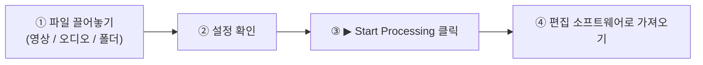
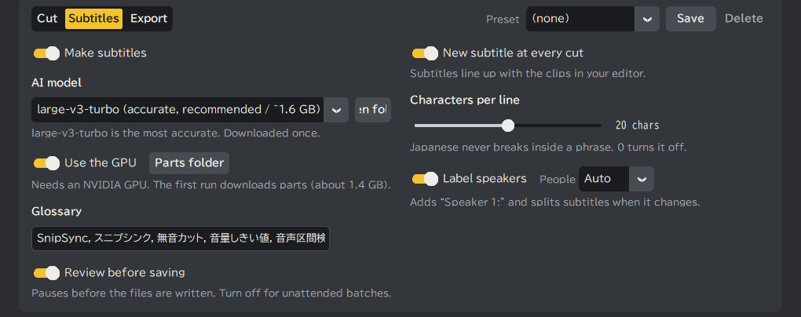
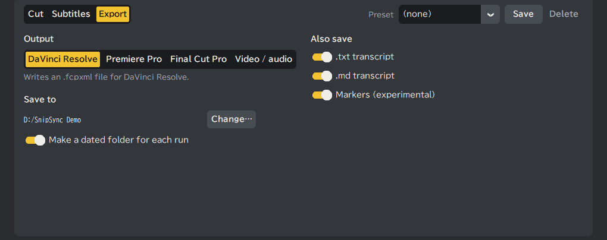
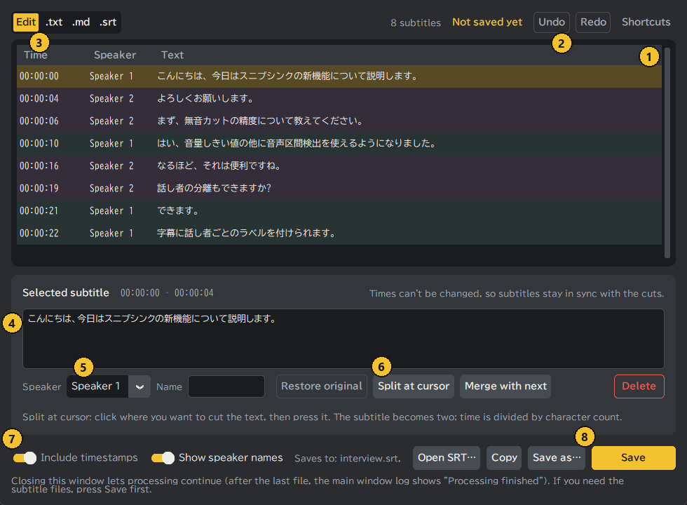
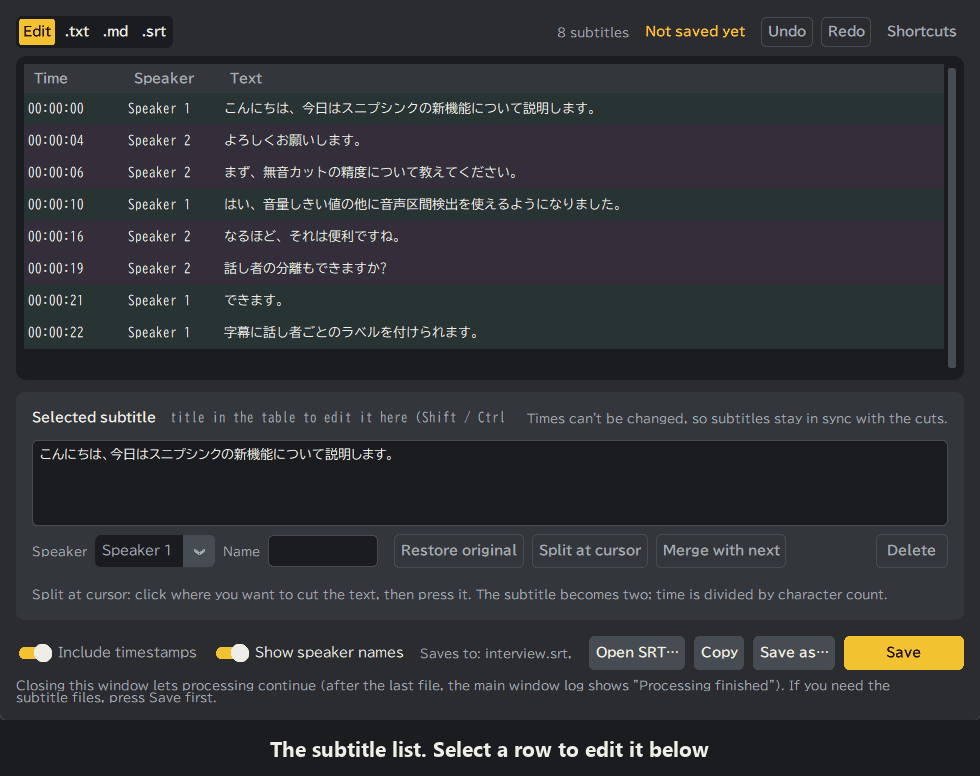

<div align="center">

<h1>✂ SnipSync</h1>
<p><strong>무음 컷, AI 자막, 화자별 문자 기록을 자동화하는 Windows 앱. 편집 소프트웨어로 바로 가져올 수 있는 타임라인도 내보냅니다</strong></p>

[](https://www.python.org/)
[](https://github.com/TomSchimansky/CustomTkinter)
[](https://github.com/SYSTRAN/faster-whisper)
[](https://github.com/WyattBlue/auto-editor)
[](LICENSE)
[](https://www.microsoft.com/windows)
[](https://github.com/R3NeR3N/SnipSync/releases/latest)

[English](README.md) | [日本語](README_JA.md) | [简体中文](README_ZH.md) | [한국어](README_KO.md)

</div>

---

**목차**

- [SnipSync 소개](#snipsync-소개)
- [✨ 주요 기능](#-주요-기능)
  - [지원하는 내보내기 형식](#지원하는-내보내기-형식)
  - [지원하는 입력 형식](#지원하는-입력-형식)
- [🚀 설치](#-설치)
  - [방법 A: 빌드된 EXE 실행 (권장)](#방법-a-빌드된-exe-실행-권장)
  - [방법 B: 소스에서 실행](#방법-b-소스에서-실행)
  - [방법 C: EXE 직접 빌드 (PyInstaller)](#방법-c-exe-직접-빌드-pyinstaller)
- [⚙️ 사용 가이드](#%EF%B8%8F-사용-가이드)
  - [빠른 시작](#빠른-시작)
  - [설정 항목](#설정-항목)
  - [용도별 방법](#용도별-방법)
  - [편집 소프트웨어로 가져오기](#편집-소프트웨어로-가져오기)
  - [참고](#참고)
- [🖥️ 시스템 요구 사항](#%EF%B8%8F-시스템-요구-사항)
  - [실행 환경 (EXE 사용자)](#실행-환경-exe-사용자)
  - [개발 환경 (소스 사용자)](#개발-환경-소스-사용자)
- [📜 라이선스 (License)](#-라이선스-license)

---

## SnipSync 소개

**SnipSync**는 비디오 편집에서 가장 번거로운 작업을 자동화하는 Windows용 독립 실행형 데스크톱 애플리케이션입니다. 비디오 파일을 드래그 앤 드롭하기만 하면 SnipSync가 다음을 수행합니다:

1. **무음 구간 자동 감지 및 제거** — `auto-editor`로 구동되며, 설정 가능한 오디오 임계값을 사용합니다.
2. **바로 가져올 수 있는 타임라인 내보내기** — 렌더링 없이 선택한 형식(.fcpxml 또는 .xml)으로 내보냅니다.
3. **완벽하게 동기화된 자막 파일(.srt) 생성** — 내장된 AI 음성 인식 엔진 `faster-whisper`를 사용합니다.

자막 생성 파이프라인은 원본 소스가 아닌 **이미 컷 편집된** 오디오에 대해 음성 인식을 실행하므로, `.srt` 파일의 타임코드가 내보낸 타임라인과 항상 완벽하게 동기화됩니다. 타 도구에서 발생하는 오디오와 자막의 싱크 어긋남 문제를 근본적으로 해결했습니다.

Python을 설치할 필요가 없습니다. SnipSync는 단일 `.exe` 파일로 실행됩니다.

**회의록 작성에도 쓸 수 있습니다.** Zoom이나 Teams, 대면 회의를 녹음한 음성을 넣으면, 무음을 줄인 음성을 화자별로 나누어 글로 옮기고 `.txt` 또는 `.md`로 내보냅니다. 화자에 「야마다」「사토」 같은 이름을 붙일 수 있어서, 회의록 초안으로 바로 쓸 수 있습니다. 영상 없이 음성 파일만으로도 처리됩니다. 음성 인식과 화자 분리에는 오류가 남으므로, 자막 확인 창에서 고친 뒤에 저장하세요.

---

## ✨ 주요 기능

| 기능 | 세부 정보 |
|---|---|
| 🔇 **무음 자동 컷 편집** | 모든 비디오에서 무음 구간을 자동으로 감지하고 제거합니다. |
| 🎬 **NLE 타임라인 내보내기** | DaVinci Resolve, Final Cut Pro 및 Premiere 파이널 컷용 타임라인을 내보냅니다. |
| 📝 **AI 자막 생성** | `faster-whisper`를 통해 타임코드 어긋남 없는 `.srt` 파일을 생성합니다. |
| ⚙️ **세밀한 설정 제어** | 오디오 임계값(%)과 무음 여백(초)을 세밀하게 조정할 수 있습니다. |
| 🤖 **AI 모델 선택** | 속도와 정확도에 맞게 `tiny` / `base` / `small` / `medium` / `large-v3-turbo` / `large-v3` 중에서 고를 수 있습니다. 일본어 특화 `kotoba-whisper`(실험적)와 영어 전용 `distil-large-v3`도 있습니다 |
| 🌐 **다국어 UI 지원** | 런타임에 영어 / 일본어 인터페이스를 전환할 수 있습니다. |
| 📁 **드래그 앤 드롭** | 비디오 파일을 앱 창에 끌어다 놓기만 하면 됩니다. |
| 📦 **제로 설정** | 단일 `.exe` 파일로 실행되며, Python이나 종속성을 설치할 필요가 없습니다. |
| 🎙 **음성 구간 감지 컷** | 볼륨 임계값 또는 음성 감지(Silero VAD) 선택, 무음을 자르지 않고 배속 처리도 가능 |
| 〰 **파형 미리보기** | 처리 전에 어디가 잘리는지 확인 |
| 🧩 **일괄 처리·오디오 파일** | 여러 파일/폴더 일괄 처리, 오디오 전용 입력과 컷 미디어 내보내기 지원 |
| 🈶 **읽기 쉬운 자막** | 일본어 문절 줄바꿈(BudouX), 용어 사전, 화자 분리(선택) |
| 📄 **자막 전문 내보내기** | `.txt` / `.md` / `.srt` 로 미리보기·저장 |
| 📍 **타임라인 마커** | 컷 지점·화자 전환 마커를 선택적으로 추가(DaVinci Resolve 21 에서 확인함. Premiere Pro·Final Cut Pro 는 검증 전) |

### 지원하는 내보내기 형식

| 형식 | 대상 애플리케이션 | 파일 확장자 |
|---|---|---|
| `resolve` | DaVinci Resolve | `.fcpxml` |
| `final-cut-pro` | Final Cut Pro | `.fcpxml` |
| `premiere` | Adobe Premiere Pro | `.xml` |

### 지원하는 입력 형식

| 비디오 파일 | 오디오 파일 |
|---|---|
| `.mp4` | `.wav` |
| `.mov` | `.mp3` |
| `.avi` | `.m4a` |
| `.mkv` | `.flac` |
| `.wmv` | `.aac` |
| `.flv` | `.ogg` |
| `.webm` | `.opus` |
| `.m4v` | `.wma` |

---

## 🚀 설치

### 방법 A: 빌드된 EXE 실행 (권장)

> Python, FFmpeg 등 다른 소프트웨어는 필요 없습니다.

1. [Releases](https://github.com/R3NeR3N/SnipSync/releases/latest) 페이지에서 `SnipSync.exe` 를 내려받습니다.
2. PC의 원하는 위치(예: 바탕화면)에 둡니다.
3. `SnipSync.exe` 를 더블클릭해 실행합니다.

**처음 실행 시 다운로드** (인터넷 필요, 1회만):

| 내용 | 시점 | 크기 |
|---|---|---|
| Whisper 모델 | 해당 모델로 처음 자막을 만들 때 | `tiny` 0.08GB · `base` 0.15GB · `small` 0.49GB · `medium` 1.5GB · `large-v3-turbo` 1.6GB · `large-v3` 3.1GB · `distil-large-v3` 1.5GB · `kotoba-whisper` 1.5GB |
| 화자 분리 모델 | **화자 분리** 를 처음 켤 때 | 약 35MB |
| GPU 부품(cuBLAS, cuDNN) | **Use the GPU** 를 켜고 처리를 시작해 다운로드를 허용했을 때(NVIDIA GPU 전용) | 약 1.4GB(풀어 놓으면 약 2.1GB) |

> **💡 저장 위치와 삭제 방법**
> - Whisper 모델: `C:\Users\<사용자명>\.cache\huggingface\hub`
> - kotoba-whisper, 화자 분리 모델, 프리셋: `%APPDATA%\SnipSync`
> - GPU 부품: `%APPDATA%\SnipSync\cuda` (**Use the GPU** 옆의 **Parts folder** 버튼으로 열 수 있습니다)
>
> `SnipSync.exe` 를 삭제해도 이 파일들은 남습니다. 디스크 공간이 필요하면 위 폴더를 직접 삭제하세요.
>
> GPU 부품은 SnipSync 전용 사본입니다. Windows 나 다른 앱에 설치하지 않았으므로 **지워도 문제없고**, 다른 앱에 영향도 없습니다. 다음에 GPU 를 쓸 때 SnipSync 가 내려받아도 되는지 다시 묻습니다(CPU 라면 이 부품이 필요 없습니다).

---

### 방법 B: 소스에서 실행

#### 사전 준비

- Windows 10 / 11 (64비트)
- [Python](https://www.python.org/downloads/) 3.10 이상 (설치 프로그램에서 **Add python.exe to PATH** 를 체크하세요)
- [Git](https://git-scm.com/downloads) (또는 GitHub 에서 저장소를 ZIP 으로 받아 압축 해제)
- FFmpeg 는 **필요 없습니다**.

#### 순서 (PowerShell 또는 명령 프롬프트)

```bash
git clone https://github.com/R3NeR3N/SnipSync.git
cd SnipSync
python -m venv .venv
.venv\Scripts\python.exe -m pip install -e .
.venv\Scripts\python.exe -m snipsync
```

`python -m venv .venv` 는 `SnipSync` 폴더 안에 독립된 환경을 만들기 때문에 PC 전체에는 아무것도 설치되지 않습니다. 지울 때는 `.venv` 폴더를 삭제하면 됩니다.

처음 파일을 처리할 때 SnipSync 가 공식 GitHub 릴리스에서 auto-editor 31.7.2 (약 45MB)를 받아 SHA-256 을 확인한 뒤 사용합니다.

---

### 방법 C: EXE 직접 빌드 (PyInstaller)

위 순서를 마친 뒤 같은 `SnipSync` 폴더에서 실행합니다.

```bash
.venv\Scripts\python.exe -m pip install -e ".[build]"
.venv\Scripts\python.exe scripts\fetch_auto_editor.py
.venv\Scripts\python.exe -m PyInstaller build\app.spec
```

`fetch_auto_editor.py` 는 EXE 에 번들할 auto-editor 를 받아 옵니다(SHA-256 검증). 결과는 `dist\SnipSync.exe` 에 만들어집니다.

---

## ⚙️ 사용 가이드

### 빠른 시작



> 스크린샷은 합성 음성 2명으로 만든 짧은 샘플 녹음을 처리한 화면입니다. 앱 화면은 일본어/영어를 지원하며(오른쪽 위 **Language** 메뉴로 전환) 스크린샷은 영어 화면입니다. 아래 괄호 안은 화면의 영어 이름입니다.

#### 1. 메인 화면

<p align="center"></p>

| # | 위치 | 설명 |
|:-:|---|---|
| ① | 파일 선택(Choose files) / 해제(Clear) | 영상/오디오 파일(여러 개, 폴더도 가능)을 파형 위에 끌어다 놓아도 됩니다. **Choose files…** 로 선택할 수도 있습니다 |
| ② | 파형 | 처리하기 *전에* 어디가 잘리는지 볼 수 있습니다. **빨강**은 삭제, **파랑**은 배속, 회색은 남는 부분입니다. 파형을 클릭하면 재생 위치가 그곳으로 이동합니다 |
| ③ | 재생 | Previous cut / Play / Next cut, 재생 속도(0.5×~4×). 처리 전에 잘라낸 결과를 들어볼 수 있습니다 |
| ④ | 길이와 단축률 | 처리 전 → 처리 후 길이, 단축률, 컷 수. 설정을 바꾸면 **Preview again** 을 누릅니다 |
| ⑤ | 설정 탭 | **Cut**(방식·임계값·여백·무음 처리), **Subtitles**(AI 모델·화자 등), **Export**(형식·저장 위치 등) |
| ⑥ | 프리셋(Preset) | 설정 한 벌을 저장해 두었다가 불러옵니다 |
| ⑦ | **Start processing** | 전체를 실행합니다. **Stop** 으로 중단합니다 |
| ⑧ | Open output folder / Review subtitles | 처리가 끝나면 누를 수 있습니다 |
| ⑨ | 로그(Log) | 처리 경과가 표시됩니다 |

Subtitles 탭과 Export 탭은 다음과 같습니다.

<p align="center"></p>

<p align="center"></p>

#### 2. 시작하고 로그 보기

<p align="center"></p>

아래 **Log**(로그)에 컷, 음성 인식(인식된 텍스트 포함), 화자 분리, 저장된 파일이 차례로 표시됩니다. 끝나면 **Open output folder** 로 출력 위치를 열 수 있습니다.

결과는 입력 파일과 같은 폴더(또는 지정한 폴더)에 만들어집니다. **처리할 때마다 날짜 폴더 만들기**(기본값은 켜짐)를 켜 두면, 그 안에 `날짜_모델명` 폴더(예: `2026-10-04_190357_large-v3`)가 만들어지고 파일이 모두 그곳에 들어갑니다. 파일은 두 시점에 만들어집니다.

**① **Start processing** 을 누른 뒤, 처리가 진행되는 동안 만들어지는 것**

| 파일 | 내용 |
|---|---|
| `<이름>_snipsynced.fcpxml` / `.xml` | 컷이 적용된 타임라인. 컷이 끝나는 시점에 만들어집니다. 오디오 트랙이 여러 개인 영상에서 `.fcpxml`을 고르면, 오디오를 꺼낸 `<이름>_tracks` 폴더도 만들어집니다(`.fcpxml` 옆에 두세요) |
| `<이름>_snipsynced.mp4` / `.mov` / `.mkv` / `.wav` … | 내보내기 형식이 *Video / audio* 일 때의, 컷이 적용된 영상/오디오 |
| `<이름>_temp_audio.wav` 등 작업용 파일 | 자막을 만드는 동안에만 있고, 처리가 끝나면 자동으로 지워집니다 |

**② 자막 확인 창에서 **Save** 를 눌렀을 때 만들어지는 것**

**Review before saving** 이 켜져 있으면(기본값) 처리는 자막 확인 창에서 멈춥니다. 이때는 자막 파일이 아직 없습니다. **Save** 를 누르면 **고친 내용 그대로** 아래 파일이 한 번에 만들어집니다.

| 파일 | 내용 |
|---|---|
| `<이름>.srt` | 자막. 화자 이름(끌 수 있음)과 줄바꿈을 반영합니다 |
| `<이름>.txt` | 자막 전문. *.txt transcript* 에 체크했을 때만. 시각을 넣을지는 창의 *Include timestamps* 스위치를 따릅니다 |
| `<이름>.md` | 제목이 붙은 자막 전문. *.md transcript* 에 체크했을 때만 |

- 창 아래에 "Saves to: …" 가 표시됩니다. *Save as…* 는 지금 보고 있는 형식의 파일 하나만, 고른 위치에 씁니다.
- 저장하지 않고 닫으면 자막 파일은 만들어지지 않습니다(타임라인이나 영상은 ① 시점에 이미 있습니다).
- 창을 닫으면 처리가 이어집니다. 마지막 파일에서는 메인 화면 로그에 "Processing finished" 가 표시됩니다.
- **Review before saving** 을 끄면 자막 파일은 ① 시점에 만들어집니다. 나중에 **Review subtitles** 로 다시 열어 고치고 저장할 수도 있습니다(같은 파일을 덮어씁니다).
- 화자 전환 마커(마커 옵션을 켰을 때)는 자막을 저장한 직후에, **고친 뒤의 화자와 화자 이름**으로 추가됩니다. 컷 지점 마커는 ① 시점에 이미 타임라인에 들어 있습니다. 저장하지 않고 닫으면 화자 전환 마커는 들어가지 않습니다. **Review before saving** 을 끄면 ① 시점의 자막으로 만듭니다. (Resolve 에서는 대신 `_markers.edl` 을 다시 씁니다. 아래 설명 참고)
- 화자 이름은 창 아래쪽의 *Show speaker names* 스위치로 넣거나 뺄 수 있습니다. 끄면 저장·복사·미리보기의 `.srt` / `.txt` / `.md` 에서 `화자1:` 이 빠지고 본문만 남습니다. 기본은 켜짐입니다. 화자가 하나도 없으면 누를 수 없습니다. 화자 전환 마커에는 영향이 없습니다.

#### 3. (선택) 잘리는 곳 확인하기 — 파형

<p align="center"></p>

| # | 표시 내용 |
|:-:|---|
| ① | 처리 전 → 처리 후 길이, 단축률, 컷 수 |
| ② | 색 설명(남음 / 삭제 / 배속) |
| ③ | **Preview again** — 컷 설정을 바꾼 뒤 눌러서 다시 계산합니다 |
| ④ | 재생, 이전/다음 컷으로 이동, 재생 속도 |
| ⑤ | 파형 위의 띠: **빨강** = 삭제, **파랑** = 배속, 회색 = 남음 |

#### 4. (선택) 자막 확인하고 고치기 — 자막 확인·편집 창

<p align="center"></p>

| # | 할 수 있는 일 |
|:-:|---|
| ① | 자막 목록. 행을 선택하면 아래에서 고칠 수 있습니다. Shift 나 Ctrl 로 여러 행을 선택하면 한꺼번에 바꿀 수 있습니다. 고친 행에는 표시가 붙습니다 |
| ② | 되돌리기 / 다시 실행. 모든 편집을 되돌릴 수 있습니다 |
| ③ | 보기 전환: 편집, 또는 `.txt` / `.md` / `.srt` 에 쓰일 내용을 그대로 미리 보기 |
| ④ | 선택한 자막의 본문을 고칩니다 |
| ⑤ | 화자 변경(선택한 모든 행에 적용)과 “야마다” 같은 화자 이름 입력 |
| ⑥ | 커서 위치에서 나누기, 다음 자막과 합치기, 원래대로, 삭제 |
| ⑦ | **Include timestamps**(`.txt` / `.md`)와 **Show speaker names**. 저장·복사되는 내용이 달라집니다 |
| ⑧ | **Save**. 옆에 **Save as…**, **Copy**, **Open SRT…** 가 있습니다 |

<p align="center"></p>

애니메이션은 여러 행을 선택하고, 화자를 한꺼번에 바꾸고, 화자에 이름을 붙이고, `.srt` 미리 보기를 확인한 뒤, **Show speaker names** 를 끄는 순서입니다.

#### 5. 편집 소프트웨어로 가져오기

아래의 [편집 소프트웨어로 가져오기](#편집-소프트웨어로-가져오기)를 참고하세요.

### 설정 항목

| 설정 | 설명 |
|---|---|
| **무음 마진** | 컷 앞뒤에 남기는 여유 시간 (기본 `0.20초`) |
| **볼륨 임계값** | 이 값보다 작은 소리를 무음으로 간주 (기본 `4.0%`). “음성 구간 감지”에서는 사용하지 않음 |
| **컷 방식** | “볼륨 임계값” 또는 “음성 구간 감지 (VAD)”. VAD 는 사람 목소리가 아닌 부분을 모두 잘라 대체로 주변 소음에 강합니다 |
| **무음 처리** | “컷”은 무음을 삭제, “배속”은 무음을 남기되 지정한 배속(기본 ×8)으로 재생 |
| **내보내기 형식** | DaVinci Resolve / Premiere Pro / Final Cut Pro / “컷 미디어”(렌더링된 영상·오디오) |
| **처리할 때마다 날짜 폴더 만들기** | 기본값은 켜짐. 저장 위치 안에 `날짜_모델명` 폴더(예: `2026-10-04_190357_large-v3`)를 만들어 그곳에 씁니다. 처리할 때마다 다른 폴더가 되므로 이전 결과를 덮어쓰지 않습니다. 여러 파일을 한꺼번에 처리하면 모두 같은 폴더에 들어갑니다. 자막을 만들지 않으면 날짜만 씁니다. `.fcpxml` 은 오디오(`_tracks`)의 위치를 절대 경로로 가지고 있으므로, 불러온 뒤에는 폴더를 옮기지 마세요. 옮겼다면 Resolve 대화상자에서 “예”를 고르고 `_tracks` 폴더를 지정하세요 |
| **자막 생성** | Whisper 로 `.srt` 생성 |
| **AI 모델** | `tiny`/`base`/`small` 은 빠름. **정확도가 중요하면 `large-v3-turbo` 권장**. `kotoba-whisper` 는 일본어 특화지만 실험적(단어 시각이 거침). `distil-large-v3` 는 영어 전용 |
| **GPU 사용 (CUDA)** | 선택 사항. NVIDIA GPU 가 필요합니다. 처음에는 부품(약 1.4GB)을 내려받아도 되는지 먼저 묻습니다 |
| **컷 경계에서 자막 분할** | 컷마다 새 자막을 시작해 클립과 자막 위치를 맞춤 |
| **자막 한 줄 글자 수** | 일본어를 문절 단위로 줄바꿈(BudouX)하고 자막 하나를 2줄 이내로 맞춤. `0` 이면 끔 (기본 `20`) |
| **화자 분리** | 누가 말하는지 `화자1: …` 처럼 표시하고, 화자가 바뀌면 자막을 나눔. 인원을 알면 **화자 수** 를 지정하세요 |
| **.txt / .md 도 저장** | 자막 전문(화자·시각 포함)을 자막 옆에 저장 |
| **마커 추가** | 모든 컷 지점과 화자 전환을 타임라인에 마커로 추가합니다. Resolve 만 별도 파일 `<이름>_markers.edl` 로 내보냅니다 (실험적, 아래 참고) |
| **용어 사전** | 쉼표로 구분해 Whisper 가 우선했으면 하는 단어(이름, 제품명 등)를 입력 |
| **프리셋** | 설정 전체를 저장/불러오기. 실행 시 마지막 설정이 복원됩니다 |

### 용도별 방법

- **말하는 영상 → 자막과 함께 DaVinci Resolve**: 내보내기 형식 “DaVinci Resolve”, 자막 켬, 모델 `large-v3-turbo`. `.fcpxml` 을 가져온 뒤 `.srt` 를 가져옵니다.
- **여러 명이 나오는 인터뷰·팟캐스트**: **화자 분리** 를 켜고(인원을 알면 **화자 수** 지정), **.md 도 저장** 을 체크. 화자가 표시된 자막과 읽기 쉬운 문자 기록을 얻습니다.
- **시끄러운 방·배경음악**: **컷 방식** 을 “음성 구간 감지 (VAD)” 로 설정합니다.
- **쉬는 구간은 남기되 빠르게**: **무음 처리** 를 “배속” 으로 설정합니다.
- **녹음이 많을 때**: 폴더째 끌어다 놓습니다. AI 모델은 한 번만 불러와 재사용합니다.
- **깨끗한 오디오 파일만 필요할 때**: `.wav` / `.m4a` / `.mp3` 를 놓고 “컷 미디어” 를 선택합니다. `.wav` 가 출력됩니다(아래 참고).

### 편집 소프트웨어로 가져오기

메뉴 이름은 버전에 따라 조금 다를 수 있습니다.

| 편집 소프트웨어 | 타임라인 | 자막 |
|---|---|---|
| DaVinci Resolve | 파일 → 가져오기 → 타임라인… 에서 `.fcpxml` 선택 | 파일 → 가져오기 → 자막…, 또는 `.srt` 를 타임라인으로 드래그 |
| Premiere Pro | 파일 → 가져오기 에서 `.xml` 선택 | `.srt` 를 가져와 시퀀스로 드래그 |
| Final Cut Pro | 파일 → 가져오기 → XML… 에서 `.fcpxml` 선택 | 파일 → 가져오기 → 캡션… |

### 참고

- **4K 미디어 내보내기**: 번들된 auto-editor(라이선스 키 없음)는 렌더링 결과를 3200×1800 이하로 자동 축소합니다. 시작 전에 SnipSync 가 경고합니다. **타임라인 내보내기는 영향이 없으므로** 원본 해상도가 필요하면 타임라인을 사용하세요.
- **오디오 전용 컷 미디어**는 `.wav` / `.flac` / `.ogg` / `.opus` 로 출력합니다. `.mp3` / `.m4a` / `.aac` / `.wma` 는 번들된 auto-editor 에 인코더가 없어 `.wav` 로 출력됩니다.
- **마커**는 실험적 기능입니다. DaVinci Resolve 21 에서는 가져오기를 확인했지만, Premiere Pro 와 Final Cut Pro 에서는 아직 확인하지 않았습니다. **DaVinci Resolve 는 `.fcpxml` 의 마커를 읽지 않으므로**, Resolve 용 마커는 별도 파일 `<이름>_markers.edl` 로 내보냅니다(파란색 = 컷 지점, 노란색 = 화자 전환). 미디어 풀에서 마커를 넣을 타임라인의 **아이콘**을 오른쪽 클릭하고 **Timelines > Import > Timeline Markers from EDL** 을 골라 그 파일을 불러오세요. 빈 곳을 오른쪽 클릭했을 때 나오는 “타임라인 > 가져오기 > AAF / EDL / XML…” 은 쓰지 마세요. EDL 이 1프레임짜리 클립으로 이루어진 별도의 타임라인으로 들어옵니다. EDL 의 시각은 타임라인의 시작 타임코드에 맞춰져 있습니다. Premiere Pro 와 Final Cut Pro 에서는 마커가 타임라인 파일 안에 들어갑니다.
- **컷 결과가 SnipSync 0.1.0 과 다릅니다**: 새 auto-editor 는 너무 짧은 컷과 클립도 제거하므로(`--smooth`) 컷 수가 줄고 하나가 길어집니다.
- 자막은 처음 말한 단어부터 시작하므로 각 자막은 클립 시작보다 조금 늦게 시작합니다. 정상 동작입니다(마진 구간은 무음으로 남아 있음).

---

## 🖥️ 시스템 요구 사항

### 실행 환경 (EXE 사용자)
- **OS:** Windows 10 / 11 (64비트)
- **RAM:** 최소 4GB. `medium` 이상 모델은 8GB 이상 권장
- **디스크:** 선택한 Whisper 모델에 따라 약 0.1–3GB (처음에만)
- **인터넷:** 처음 다운로드(Whisper 모델, 화자 분리 모델)할 때만 필요
- **GPU:** (선택) NVIDIA GPU. 필요한 부품(cuBLAS, cuDNN)은 EXE 에 포함되지 않으며, 처음 사용할 때 허락을 받은 뒤 내려받습니다.

### 개발 환경 (소스 사용자)

| 패키지 | 용도 |
|---|---|
| auto-editor 31.x *(공식 바이너리. `src/snipsync/core/aebin.py` 가 받아서 검증)* | 무음/음성 컷 및 NLE 내보내기 엔진 |
| `faster-whisper` | AI 음성 인식(CTranslate2) 및 Silero VAD |
| `sherpa-onnx` | 화자 분리 |
| `budoux` | 일본어 문절 줄바꿈 |
| `defusedxml` | XML 안전하게 읽기 |
| `av` · `numpy` | 오디오 디코딩·처리 |
| `customtkinter` · `tkinterdnd2` | GUI 와 드래그 앤 드롭 |
| `pyinstaller` | *(빌드 전용)* 단일 `.exe` 로 패키징 |

---

## 📜 라이선스 (License)

이 프로젝트는 **MIT License** 조건에 따라 라이선스가 부여됩니다.

> **면책 조항:** SnipSync는 어떠한 보증도 없이 "있는 그대로(as-is)" 제공됩니다. 작성자는 이 소프트웨어의 사용으로 인해 발생하는 데이터 손실, 파일 손상 또는 기타 문제에 대해 책임을 지지 않습니다. 항상 원본 소스 영상의 백업을 보관하시기 바랍니다.

> SnipSync 는 내부적으로 [auto-editor](https://github.com/WyattBlue/auto-editor)(Unlicense. 공식 바이너리는 라이선스 키가 없으면 *렌더링* 결과를 3200×1800 으로 제한하지만 타임라인 내보내기는 영향이 없습니다), [faster-whisper](https://github.com/SYSTRAN/faster-whisper)(MIT), [BudouX](https://github.com/google/budoux)(Apache-2.0), [sherpa-onnx](https://github.com/k2-fsa/sherpa-onnx)(Apache-2.0) 를 사용합니다. 모델: Whisper(MIT), kotoba-whisper(MIT), pyannote segmentation-3.0 ONNX(MIT), 3D-Speaker CAM++(Apache-2.0). 각 라이선스는 해당 프로젝트를 참고하세요.

---

<div align="center">

Made with ❤️ for video creators who hate silence.

</div>
