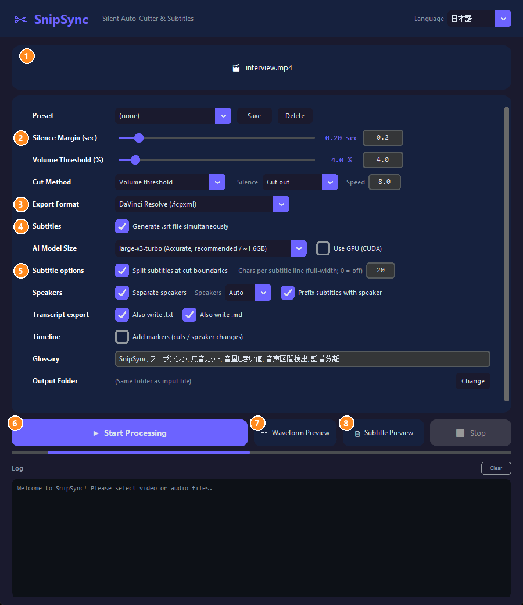
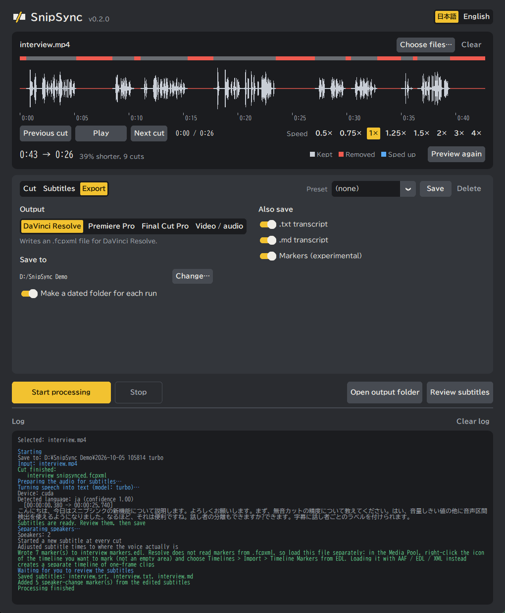
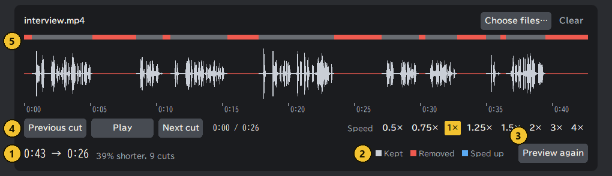
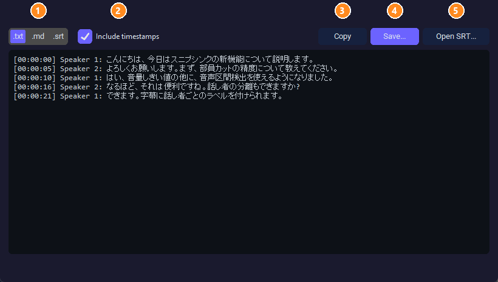

<div align="center">

<h1>✂ SnipSync</h1>
<p><strong>为专业视频剪辑师打造的静音自动剪辑与字幕生成工具</strong></p>

[](https://www.python.org/)
[](https://github.com/TomSchimansky/CustomTkinter)
[](https://github.com/SYSTRAN/faster-whisper)
[](https://github.com/WyattBlue/auto-editor)
[](LICENSE)
[](https://www.microsoft.com/windows)
[](https://github.com/R3NeR3N/SnipSync/releases/latest)

[English](README.md) | [日本語](README_JA.md) | [简体中文](README_ZH.md) | [한국어](README_KO.md)

</div>

---

**目录**

- [关于 SnipSync](#关于-snipsync)
- [✨ 主要特性](#-主要特性)
  - [支持的导出格式](#支持的导出格式)
  - [支持的输入格式](#支持的输入格式)
- [🚀 安装](#-安装)
  - [方式 A：直接运行已构建的 EXE（推荐）](#方式-a直接运行已构建的-exe推荐)
  - [方式 B：从源码运行](#方式-b从源码运行)
  - [方式 C：自行构建 EXE（PyInstaller）](#方式-c自行构建-exepyinstaller)
- [⚙️ 使用指南](#%EF%B8%8F-使用指南)
  - [快速开始](#快速开始)
  - [设置项](#设置项)
  - [常见用法](#常见用法)
  - [导入剪辑软件](#导入剪辑软件)
  - [说明](#说明)
- [🖥️ 系统要求](#%EF%B8%8F-系统要求)
  - [运行环境（EXE 用户）](#运行环境exe-用户)
  - [开发环境（源码用户）](#开发环境源码用户)
- [📜 开源协议 (License)](#-开源协议-license)

---

## 关于 SnipSync

**SnipSync** 是一款适用于 Windows 的独立桌面应用程序，旨在自动处理视频剪辑中最繁琐的部分。只需将素材拖入，SnipSync 将：

1. **自动检测并移除静音片段** — 使用可配置的音频阈值，由 `auto-editor` 驱动。
2. **导出可直接导入的实时时间线** — 以您选择的格式（.fcpxml 或 .xml）导出，无需渲染。
3. **生成完美同步的字幕文件 (.srt)** — 使用内置的 AI 转录引擎 `faster-whisper`。

由于字幕管道是在**已剪辑**的音频（而不是原始素材）上运行转录，因此 `.srt` 文件中的时间码始终与导出的时间线完美同步，这彻底解决了困扰大多数同类工具的音画不同步问题。

无需安装 Python 环境。SnipSync 作为单个 `.exe` 文件发布，开箱即用。

**也适合整理会议纪要。** 把 Zoom、Teams 或现场录下的会议音频交给它，它会把去掉静音后的音频按说话人分开转写，并导出为 `.txt` 或 `.md`。说话人可以改成「山田」「佐藤」这样的名字，导出的文字可直接作为会议纪要的初稿。只有音频文件（没有视频）也能处理。转写和说话人分离仍会有错误，请在字幕确认窗口中修改后再保存。

---

## ✨ 主要特性

| 特性 | 详情 |
|---|---|
| 🔇 **自动静音剪辑** | 自动检测并移除任何视频中的无音部分 |
| 🎬 **NLE 时间线导出** | 导出适用于 DaVinci Resolve, Final Cut Pro, 以及 Premiere Pro 的时间线 |
| 📝 **AI 字幕生成** | 使用 `faster-whisper` 生成 `.srt` 文件 — 时间码零偏移 |
| ⚙️ **精细控制** | 支持调节音量阈值 (%) 和静音边距 (秒) |
| 🤖 **AI 模型选择** | 可按速度和精度，在 `tiny` / `base` / `small` / `medium` / `large-v3-turbo` / `large-v3` 中选择。另有日语专用的 `kotoba-whisper`（实验性）和仅限英语的 `distil-large-v3` |
| 🌐 **多语言 UI** | 运行时支持英语、日语界面的自由切换 |
| 📁 **拖放支持** | 只需将视频文件拖到应用程序窗口中即可 |
| 📦 **零配置** | 单个 `.exe` 文件发布 — 免安装 Python 及任何依赖包 |
| 🎙 **语音检测剪切** | 可选音量阈值或语音检测（Silero VAD）；也可将静音加速而不是剪掉 |
| 〰 **波形预览** | 处理前即可看到哪些部分会被剪掉 |
| 🧩 **批量与音频文件** | 支持多个文件／文件夹；支持纯音频输入和导出剪切后的媒体 |
| 🈶 **易读字幕** | 日语按词组换行（BudouX）、术语表、可选说话人分离 |
| 📄 **字幕全文导出** | 可预览并保存为 `.txt` / `.md` / `.srt` |
| 📍 **时间线标记** | 可选添加剪切点／说话人切换标记（尚未在真实 NLE 中验证） |

### 支持的导出格式

| 格式 | 目标应用程序 | 文件扩展名 |
|---|---|---|
| `resolve` | DaVinci Resolve | `.fcpxml` |
| `final-cut-pro` | Final Cut Pro | `.fcpxml` |
| `premiere` | Adobe Premiere Pro | `.xml` |

### 支持的输入格式

| 视频文件 | 音频文件 |
|---|---|
| `.mp4` | `.wav` |
| `.mov` | `.mp3` |
| `.avi` | `.m4a` |
| `.mkv` | `.flac` |
| `.wmv` | `.aac` |
| `.flv` | `.ogg` |
| `.webm` | `.opus` |
| `.m4v` | `.wma` |

---

## 🚀 安装

### 方式 A：直接运行已构建的 EXE（推荐）

> 无需安装 Python、FFmpeg 或其他任何软件。

1. 从 [Releases](https://github.com/R3NeR3N/SnipSync/releases/latest) 页面下载 `SnipSync.exe`。
2. 放在电脑上的任意位置（例如桌面）。
3. 双击 `SnipSync.exe` 启动。

**首次下载**（需联网，仅一次）：

| 内容 | 时机 | 大小 |
|---|---|---|
| Whisper 模型 | 首次用该模型生成字幕时 | `tiny` 0.08GB · `base` 0.15GB · `small` 0.49GB · `medium` 1.5GB · `large-v3-turbo` 1.6GB · `large-v3` 3.1GB · `distil-large-v3` 1.5GB · `kotoba-whisper` 1.5GB |
| 说话人分离模型 | 首次开启 **分离说话人** 时 | 约 35MB |
| GPU 组件（cuBLAS、cuDNN） | 开启 **Use the GPU** 并开始处理，且允许下载时（仅限 NVIDIA GPU） | 约 1.4GB（解压后约 2.1GB） |

> **💡 保存位置与删除方法**
> - Whisper 模型：`C:\Users\<用户名>\.cache\huggingface\hub`
> - kotoba-whisper、说话人分离模型、预设：`%APPDATA%\SnipSync`
> - GPU 组件：`%APPDATA%\SnipSync\cuda`（可用 **Use the GPU** 旁边的 **Parts folder** 按钮打开）
>
> 删除 `SnipSync.exe` 不会删除这些文件。如需释放磁盘空间，请手动删除上述文件夹。
>
> GPU 组件是 SnipSync 专用的副本，没有装进 Windows 或其他应用，所以**删除也没有问题**，不会影响其他应用。下次使用 GPU 时，SnipSync 会再次询问是否下载（使用 CPU 则不需要这些组件）。

---

### 方式 B：从源码运行

#### 前提

- Windows 10 / 11（64 位）
- [Python](https://www.python.org/downloads/) 3.10 或更高版本（安装时请勾选 **Add python.exe to PATH**）
- [Git](https://git-scm.com/downloads)（或从 GitHub 下载仓库 ZIP 并解压）
- **不需要** FFmpeg。

#### 步骤（PowerShell 或命令提示符）

```bash
git clone https://github.com/R3NeR3N/SnipSync.git
cd SnipSync
python -m venv .venv
.venv\Scripts\python.exe -m pip install -e .
.venv\Scripts\python.exe src\app.py
```

`python -m venv .venv` 会在 `SnipSync` 文件夹内创建独立环境，不会向系统全局安装任何东西。要清除时，删除 `.venv` 文件夹即可。

首次处理文件时，SnipSync 会从官方 GitHub Release 下载 auto-editor 31.7.2（约 45MB），校验 SHA-256 后再使用。

---

### 方式 C：自行构建 EXE（PyInstaller）

完成上述步骤后，在同一个 `SnipSync` 文件夹中运行：

```bash
.venv\Scripts\python.exe -m pip install -e ".[build]"
.venv\Scripts\python.exe scripts\fetch_auto_editor.py
.venv\Scripts\python.exe -m PyInstaller build\app.spec
```

`fetch_auto_editor.py` 会下载要内置到 EXE 的 auto-editor（已校验 SHA-256）。输出文件为 `dist\SnipSync.exe`。

---

## ⚙️ 使用指南

### 快速开始


> 截图使用的是由两个合成语音组成的简短示例录音。应用界面支持日语和英语（右上角 **Language** 菜单切换），截图为英语界面，下文括号内为界面上的英文名称。

#### 1. 主界面

<p align="center"></p>

| # | 位置 | 说明 |
|:-:|---|---|
| ① | 投放区 | 将一个或多个视频/音频文件（或整个文件夹）拖到这里，也可点击选择 |
| ② | 剪切设置 | **静音余量**（Silence Margin）、**音量阈值**（Volume Threshold）、**剪切方式**（Cut Method：音量/语音检测）、**静音处理**（Silence：剪掉/加速） |
| ③ | 导出格式（Export Format） | DaVinci Resolve / Premiere Pro / Final Cut Pro，或 *Cut media*（已渲染的视频/音频） |
| ④ | 字幕（Subtitles） | 开关字幕并选择 AI 模型。追求精度推荐 `large-v3-turbo` |
| ⑤ | 字幕细节与选项 | 按剪切点拆分、每行字数、**说话人分离**（Separate speakers）、`.txt` / `.md` 导出、标记、术语表、输出文件夹 |
| ⑥ | **▶ Start Processing** | 执行全部处理。**■ Stop** 可中断 |
| ⑦ | Waveform Preview（波形预览） | 处理*之前*先看哪些部分会被剪掉 |
| ⑧ | Subtitle Preview（字幕预览） | 阅读、复制、保存完整文字稿 |

#### 2. 点击开始并查看日志

<p align="center"></p>

底部的 **Log**（日志）会依次显示剪切、语音识别（含识别出的文字）、说话人分离以及写出的文件。处理完成后，会询问是否打开输出文件夹。

输出文件保存在输入文件所在文件夹（或你指定的文件夹）。开启**每次处理都建一个日期文件夹**（默认开启）时，会在其中建一个 `日期_模型名` 文件夹（例如 `2026-10-04_190357_large-v3`），所有文件都放进去。文件在两个时间点生成。

**① 点击 **Start processing** 后，处理进行期间生成的文件**

| 文件 | 内容 |
|---|---|
| `<名称>_snipsynced.fcpxml` / `.xml` | 剪切后的时间线，剪切完成时生成。多音轨视频选择 `.fcpxml` 时，还会生成存放提取音频的 `<名称>_tracks` 文件夹（请保持在 `.fcpxml` 旁边） |
| `<名称>_snipsynced.mp4` / `.mov` / `.mkv` / `.wav` … | 导出格式为 *Video / audio* 时，剪切后的视频或音频 |
| `<名称>_temp_audio.wav` 等工作文件 | 仅在生成字幕期间存在，处理结束后自动删除 |

**② 在字幕确认窗口点击 **Save** 时生成的文件**

**Review before saving** 开启（默认）时，处理会停在字幕确认窗口。此时还没有字幕文件。点击 **Save** 后，会**按你修改后的内容**一次性写出下列文件。

| 文件 | 内容 |
|---|---|
| `<名称>.srt` | 字幕，已反映说话人名称（可关闭）和每行的换行 |
| `<名称>.txt` | 完整文字稿，仅在勾选 *.txt transcript* 时生成。是否带时间，取决于窗口中的 *Include timestamps* 开关 |
| `<名称>.md` | 带标题的完整文字稿，仅在勾选 *.md transcript* 时生成 |

- 窗口底部会显示 "Saves to: …"。*Save as…* 只把当前显示的格式写到你选的位置。
- 不保存就关闭，则不会生成字幕文件（时间线或媒体在 ① 时已经存在）。
- 关闭窗口后，处理会继续。处理完最后一个文件时，主窗口的日志会显示 "Processing finished"。
- 关闭 **Review before saving** 后，字幕文件在 ① 时生成。之后仍可用 **Review subtitles** 重新打开、修改并再次保存（覆盖同一文件）。
- 说话人切换标记（开启标记选项时）会在保存字幕后立即添加，使用**你修改后的说话人和说话人名称**。剪切点标记在 ① 时已经写入时间线。不保存就关闭，则不会添加说话人切换标记。关闭 **Review before saving** 时，则根据 ① 时的字幕生成。
- 说话人名称可以用窗口底部的 *Show speaker names* 开关打开或关闭。关闭后，保存、复制和预览的 `.srt` / `.txt` / `.md` 中不再带 `说话人1：`，只保留正文。默认开启。没有任何说话人时，开关不可用。不影响说话人切换标记。

#### 3.（可选）查看将被剪掉的位置 — 波形预览

<p align="center"></p>

| # | 显示内容 |
|:-:|---|
| ① | 处理前 → 处理后的时长、缩短比例和剪切数量 |
| ② | **红色** = 删除的部分，**橙色** = 加速的部分，其余保留 |
| ③ | 修改余量、阈值或剪切方式后，点击 **Recalculate**（重新计算） |

#### 4.（可选）阅读完整文字稿 — 字幕预览

<p align="center"></p>

| # | 作用 |
|:-:|---|
| ① | 在 `.txt`、`.md`、`.srt` 视图之间切换 |
| ② | 显示或隐藏时间戳（Include timestamps） |
| ③ | **Copy**（复制）到剪贴板 |
| ④ | **Save…**（保存）为文件 |
| ⑤ | **Open SRT…** — 载入已有的 `.srt` 阅读，或转换为 `.txt` / `.md` |

#### 5. 导入剪辑软件

请参阅下方的[导入剪辑软件](#导入剪辑软件)。

### 设置项

| 设置 | 说明 |
|---|---|
| **静音余量** | 每个剪切点前后保留的时间（默认 `0.20 秒`） |
| **音量阈值** | 低于此值视为静音（默认 `4.0%`）。“语音检测”方式不使用 |
| **剪切方式** | “音量阈值”或“语音检测 (VAD)”。VAD 会剪掉所有非人声部分，通常更能应对环境噪音 |
| **静音处理** | “剪掉”会删除静音；“加速”会保留静音并按设定倍速播放（默认 ×8） |
| **导出格式** | DaVinci Resolve / Premiere Pro / Final Cut Pro / “剪切后的媒体”（已渲染的视频/音频） |
| **每次处理都建一个日期文件夹** | 默认开启。在保存位置内建一个 `日期_模型名` 文件夹（例如 `2026-10-04_190357_large-v3`），并写入其中。每次处理使用不同的文件夹，不会覆盖之前的结果。一次处理多个文件时，全部放在同一个文件夹里。未生成字幕时，只用日期命名。`.fcpxml` 以绝对路径记录音频（`_tracks`）的位置，导入后请不要移动文件夹。若已移动，请在 Resolve 的对话框中选择“是”，并指定 `_tracks` 文件夹 |
| **字幕生成** | 使用 Whisper 生成 `.srt` |
| **AI 模型** | `tiny`/`base`/`small` 速度快；**追求精度推荐 `large-v3-turbo`**；`kotoba-whisper` 专为日语优化但属实验性（单词时间较粗）；`distil-large-v3` 仅限英语 |
| **使用 GPU (CUDA)** | 可选。需要 NVIDIA GPU。首次使用时会先询问是否下载组件（约 1.4GB） |
| **按剪切点拆分字幕** | 在每个剪切点开始新字幕，使字幕与片段对齐 |
| **每行字幕字数** | 日语按词组换行（BudouX），每条字幕不超过 2 行。`0` 为关闭（默认 `20`） |
| **分离说话人** | 标注说话人（`说话人1：…`），说话人变化时拆分字幕。若已知人数，请设置**说话人数** |
| **同时保存 .txt / .md** | 将完整文字稿（含说话人和时间）保存在字幕旁边 |
| **添加标记** | 在时间线上为每个剪切点和说话人切换添加标记（实验性，见下方说明） |
| **术语表** | 用逗号分隔，填写希望 Whisper 优先识别的词（人名、产品名等） |
| **预设** | 保存/载入整套设置。启动时会恢复上次的设置 |

### 常见用法

- **说话类视频 → 带字幕导入 DaVinci Resolve**：导出格式选“DaVinci Resolve”，开启字幕，模型选 `large-v3-turbo`。先导入 `.fcpxml`，再导入 `.srt`。
- **多人访谈/播客**：开启**分离说话人**（已知人数则设置**说话人数**），勾选**同时保存 .md**。可得到带说话人标注的字幕和易读的文字稿。
- **嘈杂环境/有背景音乐**：将**剪切方式**设为“语音检测 (VAD)”。
- **保留停顿但加快速度**：将**静音处理**设为“加速”。
- **大量录音**：直接拖入整个文件夹。AI 模型只加载一次并重复使用。
- **只想要干净的音频文件**：拖入 `.wav` / `.m4a` / `.mp3`，选择“剪切后的媒体”，将输出 `.wav`（见下方说明）。

### 导入剪辑软件

菜单名称可能因版本而略有不同。

| 剪辑软件 | 时间线 | 字幕 |
|---|---|---|
| DaVinci Resolve | 文件 → 导入 → 时间线… 选择 `.fcpxml` | 文件 → 导入 → 字幕…，或将 `.srt` 拖到时间线 |
| Premiere Pro | 文件 → 导入，选择 `.xml` | 导入 `.srt` 并拖到序列上 |
| Final Cut Pro | 文件 → 导入 → XML… 选择 `.fcpxml` | 文件 → 导入 → 字幕… |

### 说明

- **4K 媒体导出**：内置的 auto-editor（无许可证密钥）会把渲染结果缩小到 3200×1800 以内。开始前 SnipSync 会给出警告。**时间线导出不受影响**，需要原分辨率时请使用时间线导出。
- **仅音频的剪切媒体**以 `.wav` / `.flac` / `.ogg` / `.opus` 输出。`.mp3` / `.m4a` / `.aac` / `.wma` 因内置 auto-editor 没有对应编码器，会输出为 `.wav`。
- **标记**属于实验性功能，尚未在所有剪辑软件中验证导入效果。
- **剪切结果与 SnipSync 0.1.0 不同**：新版 auto-editor 还会去除过短的剪切和片段（`--smooth`），因此剪切数量更少、单段更长。
- 字幕从第一个说出的词开始，所以每条字幕会比片段开头稍晚开始。这是正常的（余量部分保持静音）。

---

## 🖥️ 系统要求

### 运行环境（EXE 用户）
- **操作系统：** Windows 10 / 11（64 位）
- **内存：** 最低 4GB；使用 `medium` 及以上模型建议 8GB 以上
- **磁盘：** 视所选 Whisper 模型而定，约 0.1–3GB（仅首次）
- **网络：** 仅首次下载（Whisper 模型、说话人分离模型）时需要
- **GPU：**（可选）NVIDIA GPU。所需组件（cuBLAS、cuDNN）不包含在 EXE 中，首次使用时经你允许后下载。

### 开发环境（源码用户）

| 软件包 | 用途 |
|---|---|
| auto-editor 31.x *（官方二进制，由 `src/aebin.py` 获取并校验）* | 静音/语音剪切及 NLE 导出引擎 |
| `faster-whisper` | AI 语音转文字（CTranslate2）及 Silero VAD |
| `sherpa-onnx` | 说话人分离 |
| `budoux` | 日语词组换行 |
| `defusedxml` | 安全读取 XML |
| `av` · `numpy` | 音频解码与处理 |
| `customtkinter` · `tkinterdnd2` | 界面与拖放 |
| `pyinstaller` | *（仅构建时）* 打包为单个 `.exe` |

---

## 📜 开源协议 (License)

本项目基于 **MIT License** 许可协议开源。

> **免责声明：** SnipSync 按“原样”提供，没有任何保证。对于因使用本软件而导致的任何数据丢失、文件损坏或其他问题，作者概不负责。请务必保留原始素材的备份。

> SnipSync 内部使用 [auto-editor](https://github.com/WyattBlue/auto-editor)（Unlicense；官方二进制在无许可证密钥时会将*渲染*结果限制在 3200×1800，时间线导出不受影响）、[faster-whisper](https://github.com/SYSTRAN/faster-whisper)（MIT）、[BudouX](https://github.com/google/budoux)（Apache-2.0）和 [sherpa-onnx](https://github.com/k2-fsa/sherpa-onnx)（Apache-2.0）。模型：Whisper（MIT）、kotoba-whisper（MIT）、pyannote segmentation-3.0 ONNX（MIT）、3D-Speaker CAM++（Apache-2.0）。各自许可证请参阅对应项目。

---

<div align="center">

Made with ❤️ for video creators who hate silence.

</div>
